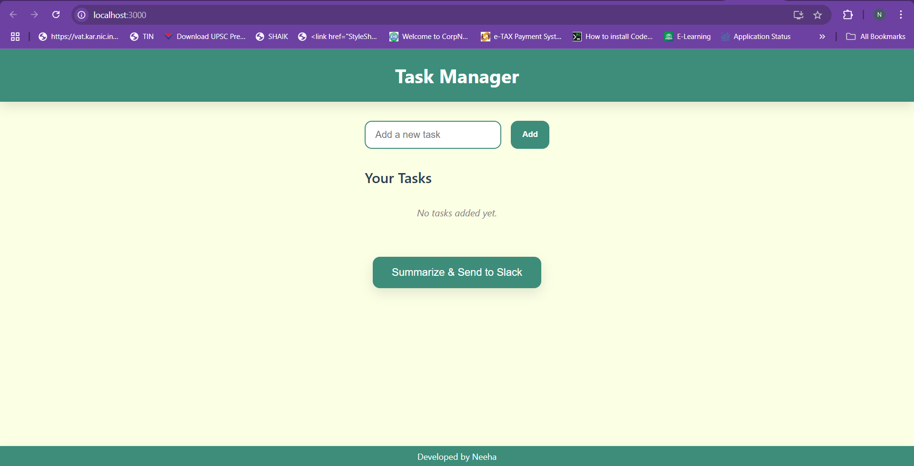
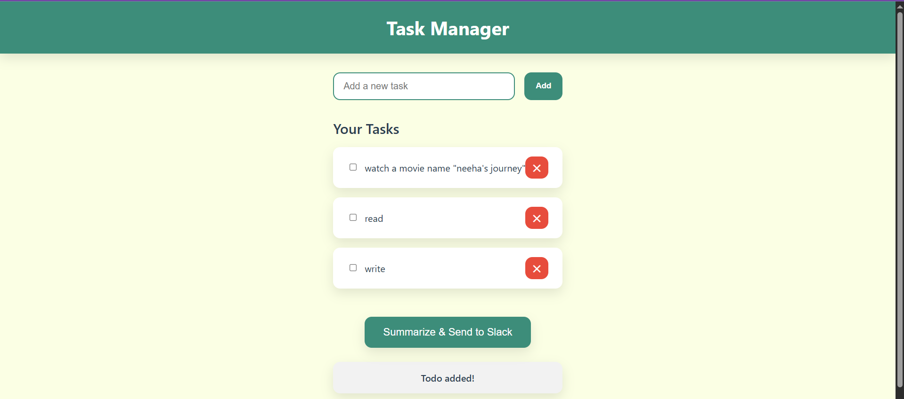
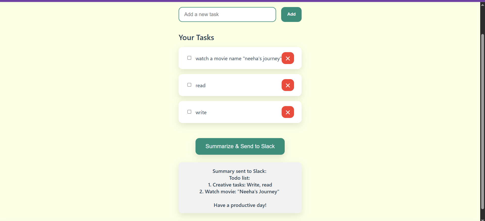
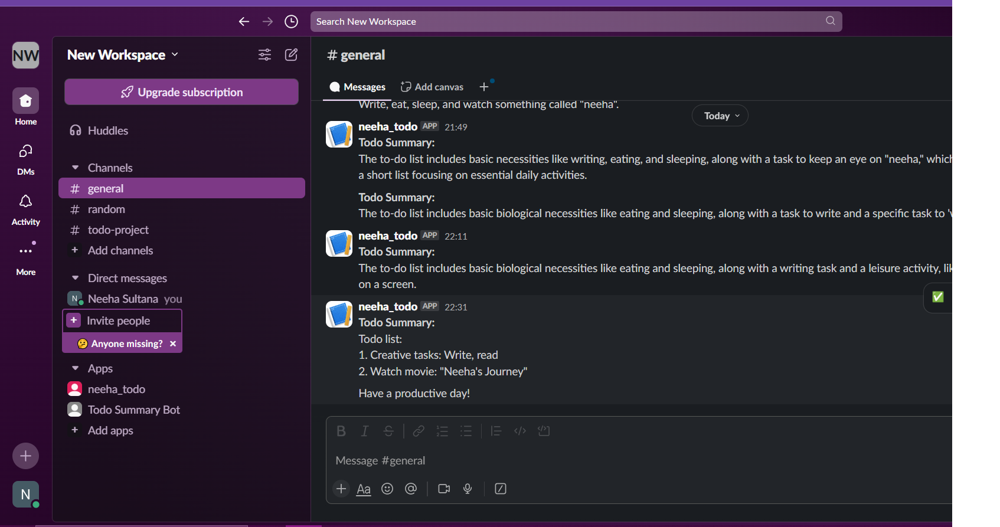
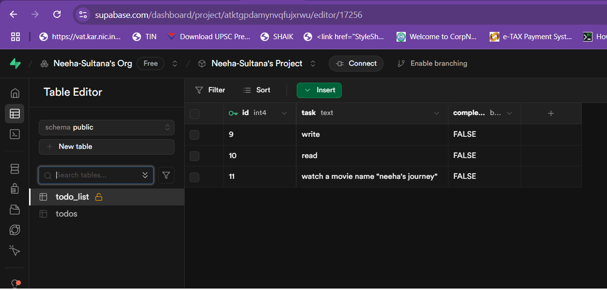
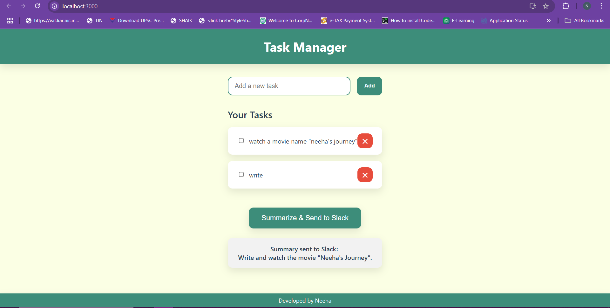

# Task Manager React App

A simple and interactive Task Manager web application built with React and Axios that allows users to add, delete, mark tasks as complete, and send summarized tasks to Slack.

---

## Table of Contents

- [Project Overview](#project-overview)  
- [Features](#features)  
- [Technologies Used](#technologies-used)  
- [Installation](#installation)  
- [Usage](#usage)  
- [Screenshots](#screenshots)  
- [Contributing](#contributing)   

---

## Project Overview

This Task Manager app allows users to efficiently manage their to-do lists. It integrates with a backend API to store tasks persistently and includes a feature to send summarized task data to a Slack channel.

---

## Features

- Add, edit, and delete to-do items.
- View the current list of to-dos.
- Generate a meaningful summary of all pending to-dos using a real LLM (OpenAI or similar).
- Send the generated summary to a configured Slack channel via Incoming Webhook.
- Display success or failure messages for Slack operations. 

---

## Technologies Used

- **Frontend:** React.js
- **Backend:** Node.js with Express
- **Database & Hosting:** Supabase (PostgreSQL)
- **LLM Integration:** CohereAI with free-tier access
- **Slack Integration:** Slack Incoming Webhooks
- Axios (for HTTP requests)  
- CSS for styling  

---

## Installation

1. Clone the repository:

   ```bash
   git clone https://github.com/your-username/task-manager-react.git
   cd task-manager-react

## Installation

2. Install dependencies:
   Frontend
   ```bash
   cd frontend
   npm install
   ```
   Backend
   ```bash
   cd ../backend
   npm install
   ```
3. Start the development server:
   ```bash
   npm start
   
4. Configure environment variables
   Create a .env file in the backend folder based on .env.example with the following variables:

   Ensure your backend API server is running and accessible at the expected endpoints (/todos, /summarize).
   ```bash
   PORT=5000
   SUPABASE_URL=your_supabase_project_url
   SUPABASE_KEY=your_supabase_anon_or_service_key
   COHERE_API_KEY=your_openai_api_key
   SLACK_WEBHOOK_URL=your_slack_incoming_webhook_url
   ```
   - SUPABASE_URL and SUPABASE_KEY: From your Supabase project dashboard.
   - OPENAI_API_KEY: Get it from OpenAI or your chosen LLM provider.
   - SLACK_WEBHOOK_URL: Configure an Incoming Webhook in your Slack workspace and copy the URL.

6. Run the application locally
   Backend
   ```bash
   cd backend
   npm start
   ```
   Frontend
   In a new terminal:
   ```bash
   cd frontend
   npm start
   ```
   Open your browser and navigate to http://localhost:3000 to use the app.

7. LLM Setup Guidance
   - Sign up at your preferred LLM provider (e.g., Cohere AI).
   - Generate an API key from their dashboard.
   - Make sure your backend calls the real LLM API for summarization (do not mock).
   - Your backend endpoint /summarize sends the to-do list content to the LLM API and formats the response.
   - Save the key in the .env file.

8. Slack Setup Guidance
   - Create or select a Slack workspace.
   - Go to Settings & administration > Manage apps.
   - Search for Incoming Webhooks and add it.
   - Configure a new webhook URL for your target channel.
   - Copy the webhook URL and set it in your backend .env as SLACK_WEBHOOK_URL.

 9. Database Setup (Supabase)
   - Create a free project on Supabase.
   - Create a table named todos with columns like id (UUID), task (text), and completed (boolean).
   - Grab your API URL and anon/public key for environment variables.

10. Deployment (Optional)
   - You can deploy the frontend on platforms like Netlify, Vercel, or Firebase Hosting.
   - Backend can be deployed on Render, Heroku, or Supabase Edge Functions.
   - Make sure to configure environment variables correctly on your deployment platform.

## Design & Architecture Decisions
 - Frontend and backend are separate projects for modularity and scalability.
 - Used React for frontend for fast UI development and state management.
 - Node.js with Express for backend API endpoints and integration with Supabase, LLM, and Slack.
 - Supabase chosen for easy-to-use PostgreSQL database with free-tier hosting.
 - OpenAI API integrated for reliable and meaningful natural language summarization.
 - Slack Incoming Webhook for simple and effective notifications.
   
 
## Usage
- Open your browser and go to http://localhost:3000 (or the port your React app runs on).
- Add tasks using the input field and "Add" button.
- Mark tasks as complete by checking the checkbox.
- Delete tasks using the ✕ button.
- Click the Summarize & Send to Slack button to generate a summary of tasks and send it to Slack.

Features
Add, delete, and mark tasks as complete.

Real-time updates of task list.

Send task summary to Slack.

Responsive UI with clean design.

## Screenshots

### 1. Initial Page Load


### 2. After Adding Tasks


### 3. Summarize and Send to Slack Button


### 4. Summary Message in Slack


### 5. Data Stored in Supabase Database

### 6. Delete a Task



## Author
Neeha Sultana
